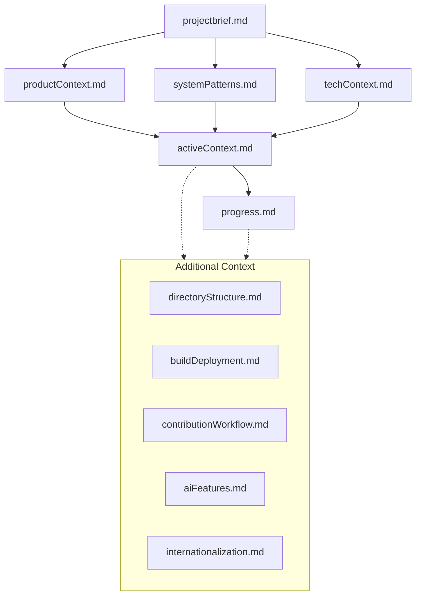

# Lobe Chat Memory Bank

This Memory Bank serves as the central repository for project knowledge and context for the Lobe Chat application. It provides comprehensive documentation of the project's goals, architecture, implementation details, and current status.

## Core Files

These files form the foundation of the Memory Bank and should be reviewed first:

- [**Project Brief**](projectbrief.md) - Core requirements, objectives, and goals
- [**Product Context**](productContext.md) - Why this project exists and the problems it solves
- [**System Patterns**](systemPatterns.md) - System architecture and design patterns
- [**Technical Context**](techContext.md) - Technologies used and technical constraints
- [**Active Context**](activeContext.md) - Current work focus and next steps
- [**Progress**](progress.md) - What works, what's left to build, and current status

## Additional Context

These files provide deeper insights into specific aspects of the project:

- [**Directory Structure**](directoryStructure.md) - Detailed explanation of each file and folder
- [**Build & Deployment**](buildDeployment.md) - How the app is built, tested, and deployed
- [**Contribution Workflow**](contributionWorkflow.md) - Process for contributing to the project
- [**AI Features**](aiFeatures.md) - AI capabilities, integrations, and architecture
- [**Internationalization**](internationalization.md) - i18n architecture and implementation

## Project Intelligence

- [**.clinerules**](.clinerules) - Project-specific patterns, preferences, and insights

## Memory Bank Usage

This Memory Bank follows a specific structure to maintain comprehensive knowledge about the Lobe Chat project:

### When to Consult the Memory Bank

- At the start of any new task to understand context
- When exploring unfamiliar parts of the codebase
- Before making architectural decisions
- When needing to understand implementation patterns

### When to Update the Memory Bank

- After implementing significant changes
- When discovering new project patterns
- When clarifying project context
- When completing major milestones

### Update Process

1. Review all relevant files
2. Document the current state accurately
3. Clarify next steps and considerations
4. Update .clinerules with new insights
5. Keep documentation comprehensive but concise

## Hierarchy of Information

This Memory Bank is designed to provide a comprehensive understanding of the Lobe Chat project, ensuring continuity of knowledge and consistent implementation patterns throughout development.
