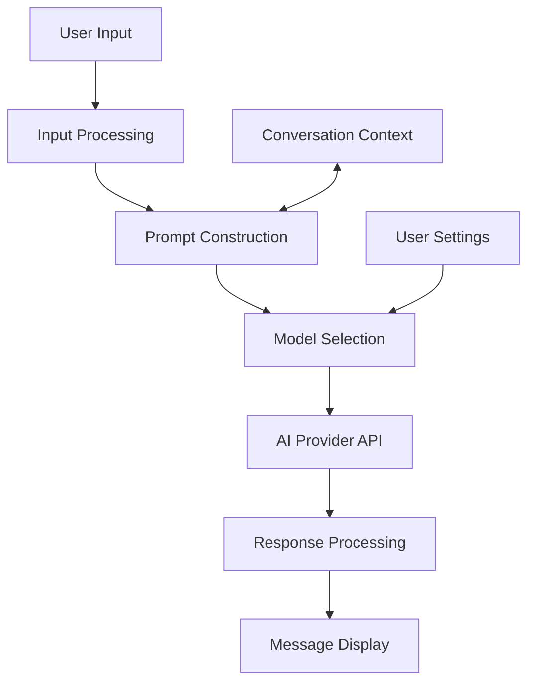
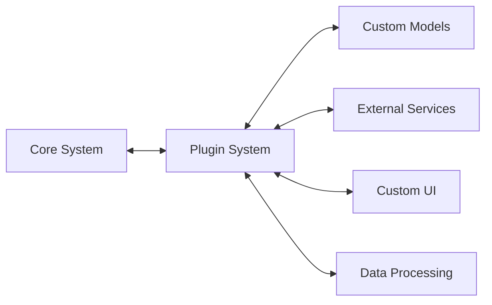

# AI Features: Lobe Chat

This document outlines the AI capabilities, integrations, and architecture within Lobe Chat, providing a detailed understanding of how the application implements and manages its core AI functionality.

## AI Model Integrations

Based on the project structure and changelog entries, Lobe Chat appears to support various AI models and providers:

### OpenAI Models

- **GPT-4**: Advanced reasoning and language understanding
- **GPT-4o**: Latest optimized model with improved capabilities
- **GPT-4o mini**: Smaller, faster version for lower-latency applications
- **GPT-4 Vision**: Multimodal capabilities for image understanding
- **GPT-3.5 Turbo**: Balanced model for general-purpose chat
- **DALL-E 3**: Image generation from text descriptions

### Other Provider Support

- **Ollama**: For local model integration (mentioned in changelog)
- Likely support for other providers through plugin architecture

## Chat Architecture

### Core Chat Implementation

The chat system appears to be implemented through several components:

1. **Chat Interface**:

   - Message display and management in UI components
   - Input mechanisms for text, voice, and files
   - Message history visualization

2. **Conversation Management**:

   - Session persistence and retrieval
   - Context management for coherent conversations
   - Conversation organization and search

3. **AI Message Processing**:
   - Prompt construction and optimization
   - Message streaming for responsive UI
   - Error handling and retry mechanisms

## Multimodal Capabilities

Based on changelog references, Lobe Chat implements several multimodal features:

### Text-to-Speech (TTS)

- Voice output for AI responses
- Likely configurable voice options
- Speech synthesis controls

### Speech-to-Text (STT)

- Voice input capability for users
- Real-time transcription
- Integration with chat flow

### Vision Features

- Image understanding via GPT-4 Vision
- Visual context in conversations
- Image upload and processing

### Text-to-Image

- DALL-E 3 integration for image generation
- Prompt processing for optimal image results
- Image management within conversations

## Plugin System

The changelog mentions a plugin system, which likely facilitates:

1. **Extensibility Architecture**:

   - Plugin registration and lifecycle management
   - Secure execution environment
   - Data flow between plugins and core system

2. **Plugin Capabilities**:

   - Custom AI model integrations
   - Additional input/output modalities
   - External service connections
   - Custom prompt processing
   - Specialized UI components

3. **Plugin Management**:
   - Discovery and installation interface
   - Version management
   - Configuration options

## Knowledge Base and File Functionality

Recent changelog entries mention knowledge base and file upload capabilities:

1. **Knowledge Management**:

   - Document upload and processing
   - Knowledge extraction and indexing
   - Integration with chat context

2. **File Handling**:

   - File upload infrastructure
   - Document parsing and processing
   - Security and validation

3. **Contextual Retrieval**:
   - Relevant information retrieval during chat
   - Source attribution and references
   - Context window management

## Prompt Engineering

The project likely includes sophisticated prompt engineering:

1. **Prompt Templates**:

   - Located in `src/prompts/` directory
   - Pre-configured templates for different purposes
   - Parameter substitution for dynamic content

2. **Context Management**:

   - Maintaining conversation history
   - Window size optimization
   - Relevant information selection

3. **Chain of Thought**:
   - Prompt structuring for complex reasoning
   - Multi-step prompt sequences in `src/chains/`
   - Intermediate result processing

## AI Provider Interface

The system architecture likely implements:

1. **Provider Abstraction**:

   - Common interface for different AI providers
   - Model-specific parameter handling
   - Error normalization across providers

2. **Request Management**:

   - Rate limiting and quota management
   - Request retries and fallbacks
   - Streaming response handling

3. **Response Processing**:
   - Parsing and normalization
   - Content filtering/moderation
   - Error handling

## User Customization

The application appears to support user customization of AI interactions:

1. **Model Selection**:

   - User choice of available models
   - Parameter configuration (temperature, etc.)
   - Provider selection

2. **Personalization**:

   - Custom instructions or system prompts
   - User preference storage
   - Conversation style settings

3. **Advanced Settings**:
   - Context window configuration
   - Token usage monitoring
   - Model-specific optimizations

## Security and Privacy

AI-specific security considerations likely include:

1. **API Key Management**:

   - Secure storage of provider API keys
   - Key rotation policies
   - Usage monitoring

2. **Content Filtering**:

   - Input validation and sanitization
   - Response filtering
   - Abuse prevention

3. **Data Privacy**:
   - Optional local processing (via Ollama)
   - Data retention policies
   - User control over data sharing

## Performance Optimizations

The system likely implements optimizations for AI interactions:

1. **Streaming Responses**:

   - Incremental display of AI responses
   - Loading indicators and user feedback
   - Connection management

2. **Caching**:

   - Response caching for common queries
   - Embedding caching for knowledge base
   - Model parameter caching

3. **Efficient Context Management**:
   - Context summarization techniques
   - Selective history inclusion
   - Token optimization

## Future AI Capabilities

Based on recent development patterns, potential future enhancements might include:

1. **Advanced RAG** (Retrieval-Augmented Generation):

   - More sophisticated knowledge retrieval
   - Semantic search improvements
   - Multi-document reasoning

2. **Fine-tuned Models**:

   - Custom model fine-tuning capability
   - Domain-specific adaptations
   - Personalized response styles

3. **Autonomous Agents**:
   - Task-based AI agents
   - Multi-agent collaborations
   - Tool-using capabilities

This document provides a comprehensive overview of the AI features in Lobe Chat. As the project evolves and new AI capabilities are added, this documentation should be updated to reflect these changes.
