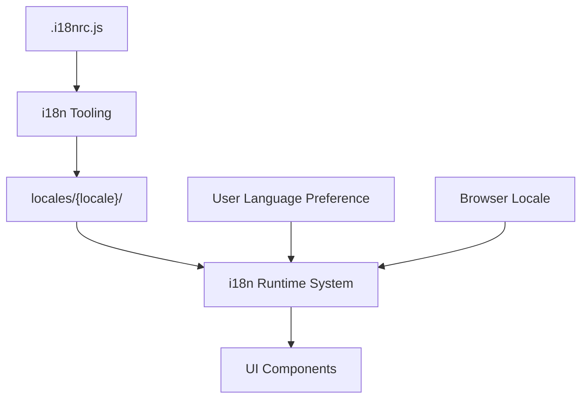

# Internationalization (i18n): Lobe Chat

This document details the internationalization (i18n) architecture, implementation, and workflows for Lobe Chat, providing insights into how the application supports multiple languages and locales.

## Overview

Lobe Chat implements comprehensive internationalization, evidenced by:

- Multiple language directories in `/locales`
- Dedicated i18n implementation documentation in `contributing/Internationalization/`
- i18n workflow tooling in `scripts/i18nWorkflow/`
- Configuration in `.i18nrc.js`

## Supported Languages

Based on the `/locales` directory structure, Lobe Chat supports a wide range of languages:

- Arabic (ar)
- Bulgarian (bg-BG)
- German (de-DE)
- English (en-US) - likely the default language
- Spanish (es-ES)
- Persian (fa-IR)
- French (fr-FR)
- Italian (it-IT)
- Japanese (ja-JP)
- Korean (ko-KR)
- Dutch (nl-NL)
- Polish (pl-PL)
- Brazilian Portuguese (pt-BR)
- Russian (ru-RU)
- Turkish (tr-TR)
- Vietnamese (vi-VN)
- Simplified Chinese (zh-CN)
- Traditional Chinese (zh-TW)

## i18n Architecture

### File Structure

The internationalization system appears to be organized across multiple directories:

1. **Static Translations**:

   - `/locales/{locale}/` - Contains translation files for each supported language
   - Likely organized into domain-specific JSON files

2. **Runtime Components**:

   - `/src/locales/` - Runtime localization support
   - Likely includes language detection, switching, and formatting utilities

3. **Workflow Tools**:
   - `/scripts/i18nWorkflow/` - Scripts for managing i18n processes
   - Potentially includes extraction, validation, and synchronization tools

### Implementation Approach

Based on standard Next.js practices and the project structure:

1. **Translation Management**:

   - JSON-based translation files
   - Key-based lookup system
   - Likely uses namespaces to organize translations by domain/component

2. **Runtime Framework**:

   - Possibly using next-i18next or a custom solution
   - Dynamic language switching
   - Locale detection from browser/user settings

3. **Component Integration**:
   - Likely uses hooks/HOCs for component-level translations
   - Formats for numbers, dates, currencies based on locale

## Key Features

### Language Detection & Switching

1. **Auto-detection**:

   - Browser language preference detection
   - URL-based language selection
   - User account preference

2. **Language Switcher**:
   - UI component for manual language selection
   - Persistence of language preference
   - Real-time application of language changes

### Text & Content Localization

1. **UI Element Translation**:

   - Static text elements
   - Dynamic content
   - Error messages and notifications

2. **Content Formatting**:

   - Date and time formatting
   - Number formatting
   - Currency display

3. **Direction Support**:
   - Right-to-left (RTL) language support for Arabic and Persian
   - Layout adjustments for RTL languages

### AI Integration

1. **Prompt Localization**:

   - Translating prompts for AI models
   - Language-specific context for AI interactions

2. **Response Handling**:
   - Processing multilingual AI responses
   - Handling language-specific characters and symbols

## Implementation Details

### Translation Loading

The system likely implements:

1. **Static Loading**:

   - JSON files loaded at build time
   - Included in application bundles

2. **Dynamic Loading**:

   - On-demand loading of language packs
   - Lazy loading to reduce initial bundle size

3. **Fallback Mechanism**:
   - Fallback to default language (likely English)
   - Missing key handling

### Translation Keys

The key structure likely follows:

1. **Hierarchical Organization**:

   - Domain/feature-based namespaces
   - Component-specific sections
   - Common shared phrases

2. **Interpolation Support**:
   - Variable substitution (e.g., `"Hello, {{username}}"`)
   - Pluralization rules
   - Conditional text

### Workflow Tools

The project includes tools for managing the i18n workflow:

1. **Key Extraction**:

   - Automated extraction from source code
   - Identification of untranslated strings

2. **Translation Synchronization**:

   - Keeping all language files in sync
   - Adding new keys to all language files
   - Flagging outdated translations

3. **Validation**:
   - Checking for missing translations
   - Validating interpolation variables
   - Ensuring consistency across languages

## Contribution Workflow

The project includes specific documentation for i18n contributions:

### Adding New Locales

Based on `contributing/Internationalization/Add-New-Locale.md`:

1. **Initial Setup**:

   - Creating locale directory structure
   - Copying base templates from reference language
   - Configuring locale metadata

2. **Translation Process**:

   - Translating all required strings
   - Adapting formatting patterns
   - Testing locale-specific features

3. **Submission Requirements**:
   - Completeness checks
   - Format validation
   - Documentation updates

### Updating Existing Translations

Based on `contributing/Internationalization/Internationalization-Implementation.md`:

1. **Finding Untranslated Content**:

   - Using workflow tools to identify missing translations
   - Prioritizing high-impact strings

2. **Translation Quality**:

   - Guidelines for consistency
   - Cultural considerations
   - Technical term handling

3. **Testing Changes**:
   - Verification in application context
   - UI layout checks for different text lengths
   - RTL testing if applicable

## Best Practices

The project likely follows these i18n best practices:

1. **String Externalization**:

   - No hardcoded strings in components
   - Consistent use of translation functions
   - Comments for translators on complex strings

2. **Context Provision**:

   - Providing context for translators
   - Using namespaces to group related strings
   - Description comments for ambiguous terms

3. **Technical Considerations**:
   - Handling of HTML within translations
   - Escaping special characters
   - Proper pluralization handling

## Performance Considerations

The i18n implementation likely addresses:

1. **Bundle Size**:

   - Code splitting for language packs
   - Lazy loading of non-default languages
   - Optimization of translation files

2. **Rendering Performance**:

   - Minimizing translation lookup overhead
   - Caching translated strings
   - Efficient re-rendering on language change

3. **Server-Side Rendering**:
   - Proper handling of i18n with SSR
   - Language detection in server context
   - Hydration with correct language

## Future Improvements

Potential areas for i18n enhancement:

1. **Automated Translation**:

   - Integration with machine translation for draft translations
   - Translation memory systems for consistency

2. **Enhanced Tooling**:

   - Visual interface for translators
   - Real-time preview of translations
   - Contextual information for translators

3. **Advanced Features**:
   - Region-specific content variations
   - A/B testing across languages
   - Personalized language preferences

This document provides a comprehensive overview of the internationalization features in Lobe Chat. As the project evolves and internationalization capabilities are enhanced, this documentation should be updated to reflect these changes.
