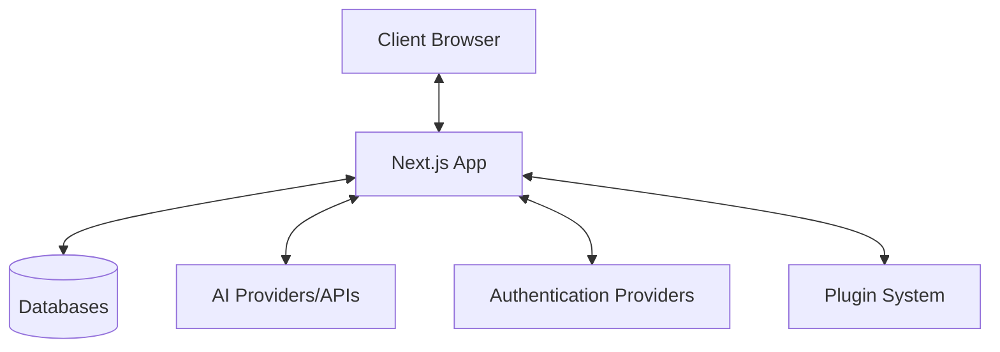
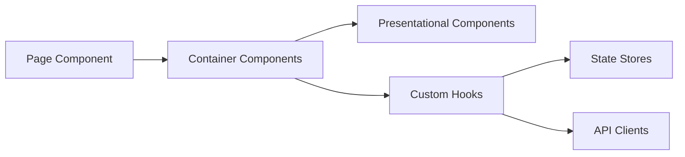
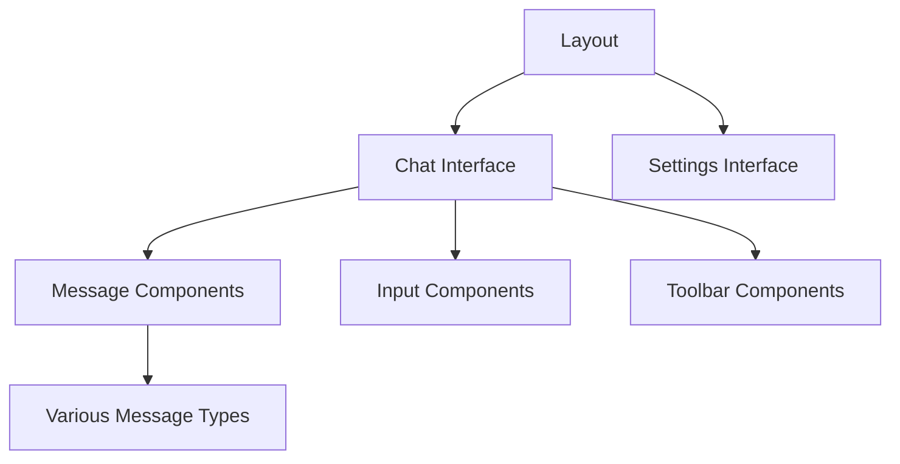
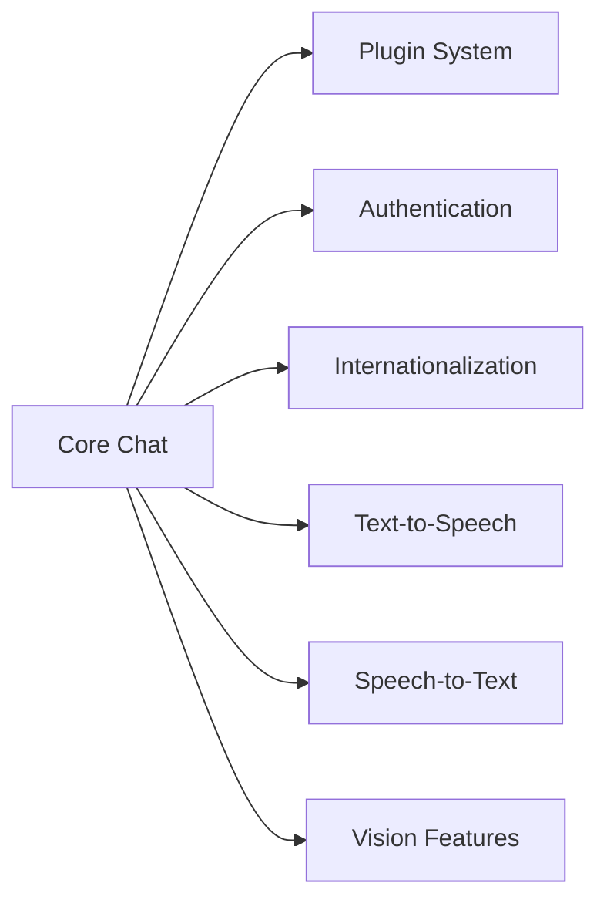
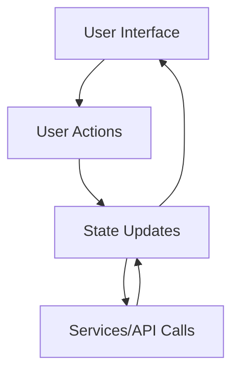

# System Patterns: Lobe Chat

## System Architecture

### Overview

Lobe Chat follows a modern web application architecture based on Next.js, utilizing its hybrid rendering capabilities and API routes. The application is structured around a modular, component-based design with clear separation of concerns.

### Key Layers

1. **Presentation Layer** - React components and UI elements
2. **Application Layer** - Features, hooks, and business logic
3. **Data Layer** - State management, API clients, database access
4. **Infrastructure Layer** - Configuration, deployment, environment setup

## Key Technical Decisions

### Framework Choices

- **Next.js**: For server-side rendering, API routes, and modern React patterns
- **TypeScript**: For type safety across the codebase
- **React**: For component-based UI development
- **Zustand**: For state management, chosen for its simplicity and performance

### Data Management

- **Database Abstraction**: Using Drizzle ORM for type-safe database operations
- **State Management**: Zustand for global state with selector patterns
- **API Integration**: Fetch-based API clients with proper error handling

### UI Implementation

- **Component Library**: Custom component system with consistent design language
- **Styling**: CSS-in-JS approach with consistent theming
- **Responsive Design**: Mobile-first approach with adaptive layouts

### Authentication

- **Multiple Providers**: Support for various authentication methods
- **Session Management**: Secure session handling with proper token management

## Design Patterns

### Frontend Patterns

- **Component Composition**: Building complex UIs from smaller, reusable components
- **Container/Presentational Pattern**: Separation of data fetching from presentation
- **Custom Hooks**: Encapsulating and reusing complex logic
- **Context Providers**: For theme, authentication, and other global contexts

### State Management Patterns

- **Store Slices**: Dividing global state into focused domains
- **Selector Pattern**: Using selectors for optimized component updates
- **Action Creators**: Encapsulating state modifications in reusable functions

### API and Data Patterns

- **Repository Pattern**: Abstracting data access behind clean interfaces
- **Adapter Pattern**: Converting between API and application data models
- **Middleware Pattern**: For logging, error handling, and request transformation

## Component Relationships

### Core Application Flow

### Feature Integration

### Data Flow

## Testing Strategy

- **Component Testing**: Unit tests for individual components
- **Integration Testing**: Testing component interactions
- **E2E Testing**: Full application flows
- **API Testing**: Verifying backend functionality

## Scalability Considerations

- **Code Splitting**: Lazy loading for optimal bundle size
- **Performance Optimizations**: Memoization, virtualization for large lists
- **Caching Strategy**: For API responses and heavy computations
- **Server-Side Optimizations**: Efficient data fetching and processing
